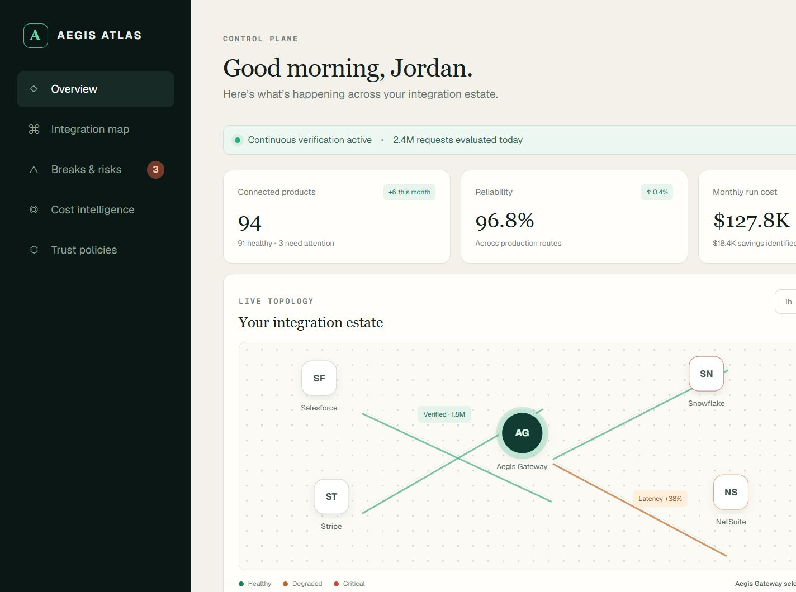
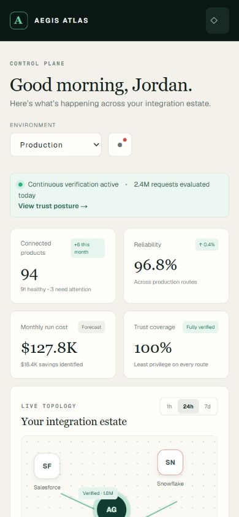
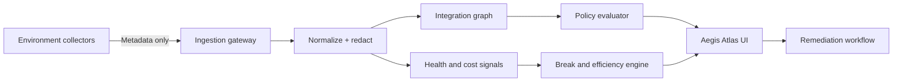

# Aegis Atlas

> Every connection. Verified.

Aegis Atlas is a zero-trust integration observability control plane for seeing how products, third-party services, and APIs connect across environments. It helps teams find broken routes, security exposure, duplicated work, idle capacity, and avoidable cost from one shared operational view.

[View the private hosted demo](https://aegis-atlas-control-plane.anglinpgj.chatgpt.site)



## Why this exists

Modern organizations often operate hundreds of integrations without one reliable inventory. Ownership is fragmented, credentials are long-lived, failures are discovered downstream, and integration cost is distributed across API usage, middleware, cloud capacity, and overlapping licenses.

Aegis Atlas is a reference implementation for a control plane that answers:

- What connects to what, in which environment, and under whose ownership?
- Which routes are broken, degraded, stale, or approaching credential expiry?
- Which integrations violate least-privilege or trust-policy expectations?
- Where are duplicate calls, idle capacity, inefficient routing, or license overlap?
- What changed, what is the likely blast radius, and what should happen next?

## Current prototype

The repository contains an interactive frontend prototype with realistic demonstration data. It includes:

- Live integration topology with health and trust state
- Production, staging, and development switching
- Break, latency, token-expiry, and stale-access findings
- Monthly and annual cost-optimization opportunities
- Zero-trust posture and continuous-verification indicators
- Responsive desktop and mobile interfaces
- Private hosted deployment and container-ready operation

> [!IMPORTANT]
> The current data is simulated. No external credentials, customer payloads, or production telemetry are collected by this version.

## Product preview

| Desktop | Mobile |
| --- | --- |
|  |  |

## Quick start

Requirements: Node.js 22.13 or newer.

```bash
npm ci
npm run dev
```

Open `http://localhost:3000`.

Production build:

```bash
npm run build
npm start
```

## Run beyond localhost

This project is not limited to local use. The demo is already hosted privately. Three supported paths are documented in [Deployment](docs/DEPLOYMENT.md):

1. OpenAI Sites for private, identity-gated hosting
2. Docker on any container host
3. Cloudflare-compatible deployment from the generated worker build

The included `Dockerfile` and GitHub build workflow make the repository portable. Real connector credentials should be supplied through the chosen platform's secret manager—not committed to this repository.

## Architecture



The production design deliberately separates the data plane from the control plane. Collectors send metadata, health signals, and cost counters—not credentials or business payloads. See [Architecture](docs/ARCHITECTURE.md) and [Security](docs/SECURITY.md).

## Documentation

- [Architecture and data model](docs/ARCHITECTURE.md)
- [Security and zero-trust model](docs/SECURITY.md)
- [Deployment guide](docs/DEPLOYMENT.md)
- [Troubleshooting runbook](docs/TROUBLESHOOTING.md)
- [Product analysis and roadmap](docs/ANALYSIS.md)
- [Contributing](CONTRIBUTING.md)

## Technology

- React 19 and TypeScript
- vinext / Vite
- Tailwind CSS processing with custom design tokens
- Cloudflare Worker-compatible server output
- GitHub Actions build verification

## Status

Prototype / reference implementation. The next milestone is a metadata-only connector SDK, persistent integration graph, policy engine, RBAC, and audit trail.

## License

No license has been selected yet. All rights are reserved by default. Add an appropriate license before accepting external contributions or reuse.
